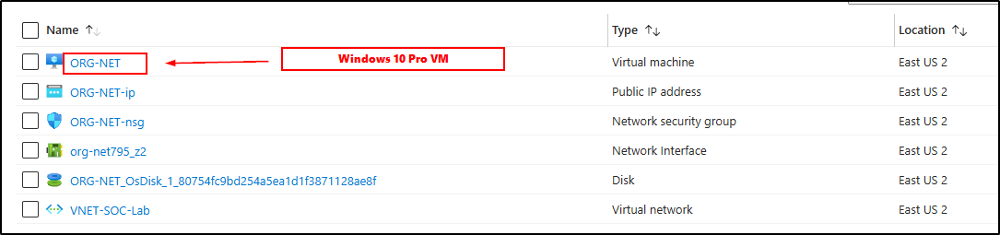

<h1 align="center">🌐 Monitoring and Investigating Endpoints with Azure Sentinel</h1>

  A full-stack investigation of malicious login attempts in an Azure-hosted Windows VM, leveraging Microsoft Sentinel, KQL, and watchlists for Geopgraphical-IP threat mapping.

<h2>📝 Summary</h2>

  This project focuses on deploying a Windows VM in Azure, collecting security logs from it, and leveraging Microsoft Sentinel to analyze and visualize attack patterns. Using Kusto Query Language (KQL), a watchlist, and a custom workbook, the project mapped attacker IPs to global locations and created a real-time threat intel dashboard. It demonstrates a complete monitoring pipeline—from raw event collection to geospatial analysis in a SIEM environment.

<h2>📌 Workflow & Integrations</h2>

<ol>
  <li>
    🗂️ <strong>Created a resource group within Microsoft Azure</strong> 
    
  </li>
  <li>
    🌠<strong>Deployed a virtual network (VNet) within the resource group</strong> 
    
  </li>
  <li>
    💻 <strong>Created a Windows 10 pro VM for and linked to the resource group and VNet</strong> 
    
  </li>
  <li>
    🔠<strong>Connected to the VM via Remote Desktop Protocol (RDP)</strong> 
  </li>
  <li>
    📶 <strong>Verified connectivity by pinging the VM’s public IP from local PC</strong> 
    
  </li>
  <li>
    📋 <strong>Viewed failed login attempts using Windows Event Viewer</strong> 
    Filtered for <code>Event ID 4625</code> to isolate failed logon attempts. 
    
  </li>
  <li>
    📊 <strong>Created a Log Analytics Workspace and linked it to Microsoft Sentinel</strong> 
    
  </li>
  <li>
    📦 <strong>Downloaded Windows Security Events via the Microsoft Sentinel Content Hub</strong> 
    
  </li>
  <li>
    🛠️ <strong>Created a Data Collection Rule (DCR) using the Azure Monitoring Agent</strong> 
    
  </li>
  <li>
    🧪 <strong>Queried logs with Kusto Query Language (KQL)</strong> 
    Used KQL to search for failed logon attempts and analyze trends. 
    
  </li>
  <li>
    🌠<strong>Created a threat intelligence watchlist with known attacker IPs and geolocations that mapped over 50,000 IP ranges.</strong> 
    
  </li>
  <li>
    📡 <strong>Executed a KQL query to match login attempts with known malicious IPs from the watchlist</strong> 
    This helped identify attacker locations. 
    
  </li>
  <li>
    🗺️ <strong>Built a workbook in Sentinel to visualize attacker locations</strong> 
    Used the advanced editor and <code>geo_ip</code> enrichment. 
    
  </li>
</ol>

